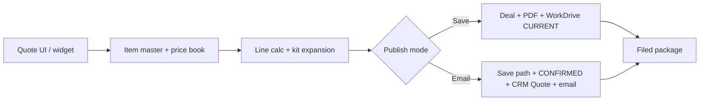

# Kinetic Bridge QTS

Quote / pricing automation: item master + tiered price books → calculated quote lines → document package → CRM filing.

Built as a **data + workflow engineering** project: catalog rules, deterministic pricing math, document generation, and idempotent publish paths—not a form demo.

**Repo:** https://github.com/blakeallard/kinetic-bridge-qts

## What I built

- **Pricing engine** — tier-scheme-aware unit prices, line totals, currency handling, and quote-line autofill from an item master / price book model.
- **Kit / BOM expansion** — vendor kit configs that expand parent SKUs into component lines with quantity rules and quote-time warnings for discontinued / unpriced items.
- **Quote UI (widget)** — Pack Bay quote builder in-repo (`widget/`), with a two-button publish UX: *Save Quote Package* vs *Email Quote Package*.
- **Publish pipeline (Deluge modules)** — modular Flow scripts for Deal sync, PDF/merge, WorkDrive CURRENT/CONFIRMED archival, CRM Quotes (email path), and stage advance—with fail-closed checks and regression-minded review fixes.
- **Local sandbox** — `local_qts/` FastAPI + widget against Postgres mirrors so CRM/quote UX can be tested without burning live API quotas.

## Architecture

Deep plans and paste checklists live under `docs/` (especially `QTS_TWO_BUTTON_CRM_PLAN.md`).

## Key engineering problems

| Problem | Approach |
| --- | --- |
| Manual spreadsheet quoting | Deterministic tier math + catalog-driven lines |
| Kit/BOM mistakes | Seeded BOM + validation scripts; warn-don't-block for edge SKUs |
| Document + CRM drift | Snapshot revision, replace prior Deal PDF, gated CRM quote upsert |
| Duplicate / partial publishes | Explicit Save vs Email semantics; fail-closed search / Writer errors |
| Live API quotas | Local Postgres sandbox for iteration without External Calls |

## Current status

**Honest state:** large Creator/Flow surface is deployed and verified for core pricing + kits; **two-button CRM package Stage 5 live E2E** was blocked on External Calls quota and resumes after reset (see `STATUS.md`).

| Area | State |
| --- | --- |
| Tier pricing + line calc | Deployed / verified |
| Kit BOM expansion | Deployed / verified |
| Writer merge / PDF path | Deployed (template polish remains) |
| Two-button publish modules | In repo; live E2E pending quota |
| Item master production edge cases | Open business decisions (duplicates, unpriced SKUs) |

Operational detail: [`STATUS.md`](STATUS.md), [`QTS_PROJECT_STATUS.md`](QTS_PROJECT_STATUS.md).

## How to evaluate this repo (60 seconds)

1. This README + architecture diagram.
2. `widget/` — front-end quote builder.
3. `scripts/qts_publish/` + `deploy_ready/` — publish / Creator paste sources.
4. `docs/QTS_TWO_BUTTON_CRM_PLAN.md` — package semantics.
5. `local_qts/` — offline CRM/quote sandbox.

## Layout

| Path | Role |
| --- | --- |
| `widget/` | Quote builder UI + dist ZIP |
| `scripts/qts_publish/` | Modular publish Flow modules |
| `deploy_ready/` | Creator-paste Deluge (prefer over raw `workflows/`) |
| `functions/` | Shared Creator functions |
| `local_qts/` | Local FastAPI + widget sandbox |
| `docs/` | Plans, runbooks, meeting requirements |
| `audit/` / `kit_bom/` | Pricing audits and BOM seed data |

## Related repos

- [`kinetic-quote`](https://github.com/blakeallard/kinetic-quote) — Postgres/Supabase mirror + datasheet provenance DB
- [`kinetic-bridge-email-intel`](https://github.com/blakeallard/kinetic-bridge-email-intel) — inbound email → AI recommendation workflow
- [`kinetic-bridge-ops`](https://github.com/blakeallard/kinetic-bridge-ops) — meeting/ops automation packages

## For agents / maintainers

Read `STATUS.md`, `AGENTS.md`, `CLAUDE.md`, and `docs/CURRENT_HANDOFF.md` before changing runtime. Prefer `deploy_ready/` for Creator pastes. Do not commit secrets.

Internal task key: `BI1-T71`. Zoho IDs and task snapshot live in `TASK.md`.
