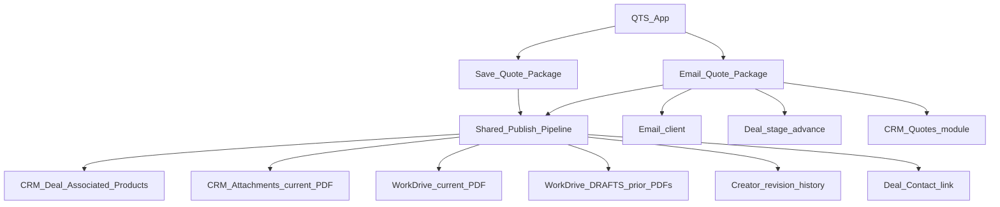

# QTS two-button CRM connectivity plan

**Execution home:** BI1-T71 (this repo).  
**Not** Supabase→Databricks. **Not** BI1-T110 product ownership (T110 only hosts some Flow Deluge/docs as external anchors today).

External path pointers: [`QTS_TWO_BUTTON_CRM_EXTERNAL_ANCHORS.md`](./QTS_TWO_BUTTON_CRM_EXTERNAL_ANCHORS.md)

**Bryan meeting backlog (Stages 6–10):** [`QTS_BRYAN_MEETING_BACKLOG_2026-07-30.md`](./QTS_BRYAN_MEETING_BACKLOG_2026-07-30.md)  
**Stage 5 paste checklist:** [`QTS_TOMORROW_PASTE_CHECKLIST.md`](./QTS_TOMORROW_PASTE_CHECKLIST.md)

## Stage board

| Stage | Status |
| ----- | ------ |
| Stage 0 — Spec lock | **complete** |
| Stage 1 — Widget UX consolidation | **complete** (widget ZIP uploaded) |
| Stage 2 — Flow pipeline hardening | **repo complete** — live paste/verify pending |
| Stage 3 — WorkDrive revision organization | **root folder created** (`QTS Quotes` ID locked); module wire pending |
| Stage 4 — Creator revision history | **helper drafted** |
| Stage 5 — Verify | **resume when External Calls headroom** — paste map in checklist; was blocked 2026-07-29 on daily quota |
| Stage 6 — Margin % column (markup + Disc %) | **planned** — see Bryan backlog |
| Stage 7 — Item Master X → Discountable polarity fix | **planned** — vendor legend: X = can discount |
| Stage 8 — Search Leads/Deals/Contacts by company | **planned** |
| Stage 9 — Daily FX_Rates_Cache refresh | **planned** — ~1 External Call/day via existing `fn_refresh_fx_rates` |
| Stage 10 — Revamp vendor Item Master spreadsheet | **planned (above & beyond)** — Creator IM already improving; rebuild workbook for efficiency/intuition |

---

## Creator API / external-call limits (LOCKED RISK — 2026-07-29)

Canonical Zoho doc: [API limits](https://www.zoho.com/creator/help/api/v2.1/api-limits.html)  
Usage UI: [Access usage details](https://www.zoho.com/creator/newhelp/account-setup/access-usage-details.html)

### Two different budgets (do not conflate)

| Bucket | What counts | What does **not** |
| ------ | ----------- | ----------------- |
| **Developer API** / **Custom API** (table on the API-limits page) | Creator REST APIs; Deluge `zoho.creator.*` integration tasks; `invokeurl` **to Creator/Custom APIs** | Integration tasks to **other Zoho services** (e.g. `zoho.crm.*`) — Zoho states these **do not** count toward Developer API |
| **External Calls** (plan “External calls” / Usage Details) | Webhooks, many non-Creator integrations, `invokeurl` outbound; **this is the pool QTS CRM Deluge hits** via `zoho.crm.*` | — |

Daily reset for API usage on that page: **00:00–23:59 Super Admin timezone**. Same idea for plan External Calls in Usage Details.

Developer / Custom API plan table (from Zoho):

| Plan | Developer API | Custom API |
| ---- | ------------- | ---------- |
| Free | 250 / day | 100 / day |
| Standard | 250 / user / day | 100 / user / day |
| Professional | 500 / user / day | 250 / user / day |
| Enterprise / Zoho One | 1000 / user / day | 500 / user / day |

Also on that page: **50 API calls / user / minute** throttle; **6 concurrent** API calls / account (HTTP 429).

Zoho tip (same page): **optimize loops** — tasks inside loops multiply usage.

### Will this be a problem when the app is deployed?

**Yes, limits still apply in production** (dev/stage are not a free pass).

For QTS specifically:

- Widget → `CRM_Bridge` → `zoho.crm.*` spends the **External Calls** budget (not the Developer API column on that HTML table).
- Error text we hit: `Total number of External Call Statements exceeded` → treat as **External Calls / integration-task budget exhausted or per-script cap**, not “fix the Developer API calculator alone.”
- Inefficient loops (one CRM search per quote line, 3–5 Contact searches per lookup) burn the day in QA **and** can fail real users after publish.
- Split bridge workflows help isolate actions; they **do not** remove the daily External Calls pool.
- Flow Writer/CRM/WorkDrive is a **separate** Flow quota.

**Mitigation before relying on prod:**

1. Batch CRM lookups (Products OR-criteria; Contact/Lead single OR search) — keep **few** `zoho.crm.*` executions per action.
2. Never re-introduce per-line CRM loops.
3. After reset: check **Usage Details → External Calls** (and Developer API if relevant) before retesting.
4. If External Calls tier is tight for sales volume, upgrade plan or buy more capacity from Billing.

### How to see usage

Not inside the QTS page:

1. Creator → **Billing** / **Setup** → **Usage Details**.
2. Read **External Calls** (CRM bridge/sync) and **Developer API** / **Custom API** (Creator REST / `zoho.creator.*`).
3. Optional usage alerts for Super Admin near cap.

### Tonight’s operating rule

- **No more Creator CRM testing until after daily reset.**
- Next session: check Usage Details first → paste efficient `fn_sync_to_crm` + **CRM Bridge - search_customers** (and `search_leads` if still multi-call) → one search + one Save only.
- Live CRM_Bridge is **split per action** (monolith “CRM Bridge” Disabled). Do **not** paste the whole monolith into the disabled workflow.

### Deploy paste map (split workflows)

Canonical Stage 5 order: [`QTS_TOMORROW_PASTE_CHECKLIST.md`](./QTS_TOMORROW_PASTE_CHECKLIST.md).

| Repo file / block | Live Creator target |
| ----------------- | ------------------- |
| `deploy_ready/creator/workflow/functions/fn_sync_to_crm.creator.deluge` | Function `fn_sync_to_crm` (used by workflow **sync_quote_to_crm**) |
| `deploy_ready/creator/workflow/form_workflows/crm_bridge/search_customers.creator.deluge` | Workflow **CRM Bridge - search_customers** |
| `deploy_ready/creator/workflow/form_workflows/crm_bridge/search_leads.creator.deluge` | Workflow **search_leads** (batched OR; company search for Leads already included) |
| Disabled **CRM Bridge** (09-Jul) | Leave disabled unless deliberately consolidating |
| Do **not** re-paste | `sync_quote_to_crm` workflow (already calls calc + `fn_sync_to_crm`) unless that action itself changes |

---

## SPEC_LOCK (Stage 0 — locked 2026-07-29)

These defaults are locked for implementation. Override only with an explicit Blake decision.

| Topic | Locked value |
| ----- | ------------ |
| Button 1 label | **Save Quote Package** |
| Button 2 label | **Email Quote Package** |
| Save → Creator Status | `PDF Filed` |
| Email → Creator Status | `Package Requested` |
| Deal stage on Email only | **Negotiation/Review** |
| WorkDrive root folder **name** | `QTS Quotes` |
| WorkDrive root folder **ID** | `wctzef9e0b057e781406896d8866994e93156` (My Folders → `QTS Quotes`) |
| WorkDrive layout | `QTS Quotes/{quote_number}/{CURRENT,CONFIRMED,DRAFTS}/` |
| Stable PDF filename | `Kinetic_Bridge_Quote_{quote_number}.pdf` |
| DRAFTS filename suffix | `r{n}_{yyyyMMdd_HHmmss}` (e.g. `Kinetic_Bridge_Quote_QUOTE0001_r2_20260729_173045.pdf`) |
| CRM Quotes subject upsert key | `Kinetic Bridge Quote {quote_number}` (**Email path only**) |
| Standalone “Update CRM deal” button | **Removed** from main UI (Deal sync is step 1 inside both publish buttons) |
| Zoho Sign / Books / OAuth scopes / secrets | **Unchanged** (out of scope) |

Config comment pattern (Deluge):

```deluge
// QTS_QUOTES_ROOT_FOLDER_ID: paste WorkDrive folder resource_id when known.
// Until then, look up a child named "QTS Quotes" under the Flow connection parent.
qts_quotes_root_folder_id = "wctzef9e0b057e781406896d8866994e93156";
qts_quotes_root_folder_name = "QTS Quotes";
```

---

## Confirmed understanding (from your sketch)

Two buttons only. Email = Save + extras. CRM Quotes is **email-only**.



| Button | Shared publish | Email client | Advance Deal stage | Create/update CRM Quotes |
| --- | --- | --- | --- | --- |
| **Save Quote Package** | Yes | No | No | **No** (explicit) |
| **Email Quote Package** | Yes | Yes | Yes | **Yes** (only here) |

### Shared publish pipeline (both buttons)

| Step | Operation | Notes |
| ---- | --------- | ----- |
| 1 | Persist Creator `Quote_Request` lines + status | One write; status distinguishes save vs email |
| 2 | Sync QTS lines → Deal **Associated Products** + totals | Replaces prior products |
| 3 | Ensure Deal ↔ Contact link | From selected CRM customer/contact |
| 4 | Writer merge → one PDF | Single merge per click |
| 5 | Archive prior **CURRENT** PDF → WorkDrive **DRAFTS** | Timestamp/revision in filename |
| 6 | Store new PDF in WorkDrive **CURRENT/** | Most active package (Save or Email) |
| 7 | Replace CRM Deal attachment so only latest shows | Delete/replace prior current attach after archive |
| 8 | Creator revision snapshot | Store previous revision metadata/payload when revision increments |

### Email-only extras

| Step | Operation |
| ---- | --------- |
| 9 | Also write/update WorkDrive **CONFIRMED/** (what the client was sent) |
| 10 | Create/update CRM **Quotes** from Deal Associated Products |
| 11 | Attach current PDF to that Quotes record (and keep Deal current attach) |
| 12 | `sendmail` existing Kinetic Bridge quote email + PDF |
| 13 | Advance Deal stage |

## WorkDrive directory layout

| Path | Holds | Updated by |
| ---- | ----- | ---------- |
| `QTS Quotes/{quote_number}/CURRENT/` | **Most active** PDF (latest Save or Email) | Both buttons |
| `QTS Quotes/{quote_number}/CONFIRMED/` | **Confirmed / client-sent** PDF (last emailed package) | **Email only** |
| `QTS Quotes/{quote_number}/DRAFTS/` | Prior CURRENT (and prior CONFIRMED when superseded by a new email) | Both (archive step) |

Stable filenames inside CURRENT/CONFIRMED (e.g. `Kinetic_Bridge_Quote_{QNO}.pdf`) so replace is deterministic. DRAFTS files get `r{n}_{yyyyMMdd_HHmmss}.pdf` suffixes.

**CRM Deal Attachments** always mirrors **CURRENT** (one latest PDF).  
**CRM Quotes** attachment (email path only) mirrors **CONFIRMED**.

## Defaults locked for this plan (override if wrong)

| Topic | Default |
| ----- | ------- |
| WorkDrive layout | `QTS Quotes/{quote_number}/{CURRENT,CONFIRMED,DRAFTS}/` as above |
| Deal stage on email | Set to **Negotiation/Review** (matches existing QTS CRM sync package path) |
| CRM Quotes subject key | `Kinetic Bridge Quote {quote_number}` upsert (same as today) |
| Creator statuses | Save → `PDF Filed` (or rename label later); Email → `Package Requested` |
| Widget buttons | Replace the three buttons with **Save Quote Package** + **Email Quote Package** |

## API efficiency — modular, condition-gated steps

Do **not** put sync + merge + WorkDrive + Quotes + email + stage in a single always-on Deluge blob that runs every branch.

| Unit (small script / Flow action) | Save Quote Package | Email Quote Package | Why separate |
| --------------------------------- | ------------------ | ------------------- | ------------ |
| `sync_deal_products` | Yes | Yes | CRM write only when publishing lines |
| `ensure_deal_contact_link` | Yes (skip if already linked) | Yes (skip if linked) | Avoid redundant CRM updates |
| `merge_quote_pdf` | Yes | Yes | One Writer merge; never duplicate for email-only extras |
| `workdrive_archive_current_to_drafts` | Yes (if prior CURRENT exists) | Yes (if prior exists) | Conditional move/copy |
| `workdrive_store_current` | Yes | Yes | CURRENT only |
| `workdrive_store_confirmed` | **No** | Yes | Email-only WorkDrive write |
| `crm_replace_deal_attachment` | Yes | Yes | Deal attach only |
| `upsert_crm_quote` + quote attach | **No** | Yes | No Quotes APIs on Save |
| `send_quote_email` | **No** | Yes | No sendmail on Save |
| `advance_deal_stage` | **No** | Yes | No stage API on Save |

Orchestration: Flow Decision on Status (`PDF Filed` vs `Package Requested`) calls **only** the steps for that branch. Shared steps can be reused Flow functions; email-only steps are never invoked on Save (zero Quotes/email/stage API cost).

Further lightweight rules:
- Skip `ensure_deal_contact_link` when Contact already matches.
- Skip WorkDrive archive when no prior CURRENT file exists.
- Fail loud after sync if Associated Products empty (don’t burn a Writer merge).
- Do not re-fetch Deal repeatedly inside each micro-script; pass IDs/context from the orchestrator.

## Recommendations

1. **Thin orchestrator + specific steps** — see API efficiency table above (not one mega-script).
2. **Always sync Deal products before PDF** so CURRENT and (on email) Quotes/CONFIRMED match QTS.
3. **Archive-then-replace** for CRM Deal attachments and WorkDrive CURRENT.
4. **Do not create CRM Quotes on Save** — matches your override; Save is internal/file/sync only.
5. **CURRENT vs CONFIRMED** — active working package vs last client-sent package; avoids ambiguity in WorkDrive.
6. **Creator revision store**: lightweight first — revision number + snapshot of lines/totals + WorkDrive file IDs. Full history module = phase 2.
7. **Remove standalone Update CRM deal** from main UI once Save includes Deal sync.

## Current code anchors (what we will reshape)

- Widget (primary edit surface): `widget/app/widget.js` + `widget.html` — Pack Bay mirror also under `artifacts/qts-widget-ui-packbay/`
- Deal product sync (T71): `functions/fn_sync_to_crm.deluge` / `deploy_ready/creator/workflow/functions/fn_sync_to_crm.creator.deluge` + widget `sync_quote_to_crm` bridge
- PDF + email + conditional Quotes (external today): T110 `scripts/generate_and_file_quote_document.deluge` — see external anchors doc
- Status → Flow mapping (external today): T110 `docs/PDF_FILE_NO_EMAIL.md`

## Staged implementation

### Stage 0 — Spec lock (this plan) — DONE

See **SPEC_LOCK** above. WorkDrive root ID remains a placeholder; name-based lookup proceeds.

### Stage 1 — Widget UX consolidation

- Two buttons only; both call one `publishQuotePackage({ email })`
- Save: status `PDF Filed`; Email: `Package Requested`
- Always run Deal sync as step 1 inside that path (no separate Update CRM button)

### Stage 2 — Flow pipeline hardening (CRM connectivity core)

- Wire **separate** Flow functions/steps (sync, merge, WD archive, WD CURRENT, Deal attach; email-only: WD CONFIRMED, Quotes, sendmail, stage)
- Decision branch: Save runs only save-column APIs; Email runs save-column + email-column APIs
- Loud failure if Deal has no products after sync (abort before Writer merge)

### Stage 3 — WorkDrive revision organization

- Ensure `QTS Quotes/{quote_number}/{CURRENT,CONFIRMED,DRAFTS}/`
- On republish: prior CURRENT → DRAFTS; write new CURRENT
- On email: also write/update CONFIRMED (archive prior CONFIRMED to DRAFTS if present)
- Write WorkDrive link(s) back to Creator if fields exist / add if needed

### Stage 4 — Creator revision history (lightweight)

- On revision > 1: snapshot prior lines/totals + prior PDF WorkDrive ID before overwrite
- Mirror DRAFTS concept inside Creator without blocking PDF path

### Stage 5 — Verify

- Save twice → Deal products update; one Deal PDF; prior PDF in DRAFTS; **no** Quotes record
- Email once → Quotes record appears; email sent; stage Negotiation/Review; current PDF on Quote + Deal
- Email again after line change → Quote updated; prior PDF in DRAFTS; one current attach

## Out of scope for first implementation pass

- Zoho Sign / Send for Signature path changes
- Books invoicing
- Native CRM inventory quote templates
- Broad Creator schema redesign beyond revision snapshot fields needed for DRAFTS parity

---

## Post–Stage 5 backlog (Bryan meeting 2026-07-30)

Canonical detail: [`QTS_BRYAN_MEETING_BACKLOG_2026-07-30.md`](./QTS_BRYAN_MEETING_BACKLOG_2026-07-30.md).

**Order after Stage 5 E2E:** Stage 7 (Discountable polarity) + Stage 9 (daily FX) → Stage 6 (Margin UI) → Stage 8 (company search) → Stage 10 (spreadsheet revamp, above & beyond).

| Stage | Summary |
| ----- | ------- |
| **6 — Margin** | New **Margin %** column (company profit markup). Header input applies % to all lines from list; per-line override. **Disc % stays.** Formula: `Sale_USD = List_EUR × usdPerEur × (1 − Disc%/100) × (1 + Margin%/100)`. |
| **7 — Discountable X** | Flip import: workbook `X` → `Discountable=Y` (vendor `Distrib discount` legend). Re-seed Creator Item_Master. Runtime Deluge already gates on Y/N. |
| **8 — Company search** | Main CRM bar: Contacts by Account/company; keep Leads `Company`; add Deals by company (and optionally Deal name). Batch CRM criteria — no loops. |
| **9 — Daily FX** | Schedule existing `fn_refresh_fx_rates` once/day (~1 External Call). Optional manual run to unstick stale cache now. |
| **10 — Spreadsheet revamp** | Above & beyond: rebuild Acme BMS / Item Master workbook so it is clearer than today’s multi-sheet RSP file and aligns with Creator Item_Master + kit configs + correct X/discount bands. Creator IM remains system of record for quoting; workbook becomes a clean vendor/ops source. |
