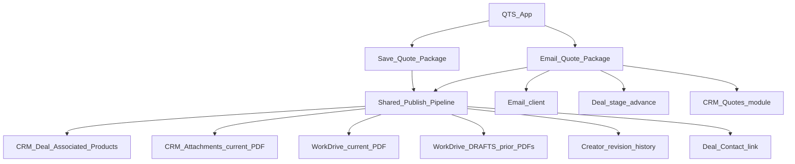

# QTS two-button CRM connectivity plan

**Execution home:** BI1-T71 (this repo).  
**Not** Supabase→Databricks. **Not** BI1-T110 product ownership (T110 only hosts some Flow Deluge/docs as external anchors today).

External path pointers: [`QTS_TWO_BUTTON_CRM_EXTERNAL_ANCHORS.md`](./QTS_TWO_BUTTON_CRM_EXTERNAL_ANCHORS.md)

## Stage board

| Stage | Status |
| ----- | ------ |
| Stage 0 — Spec lock | **in_progress** |
| Stage 1 — Widget UX consolidation | pending |
| Stage 2 — Flow pipeline hardening | pending |
| Stage 3 — WorkDrive revision organization | pending |
| Stage 4 — Creator revision history | pending |
| Stage 5 — Verify | pending |

---

## Confirmed understanding (from your sketch)

Two buttons only. Email = Save + extras. CRM Quotes is **email-only**.

| Button | Shared publish | Email client | Advance Deal stage | Create/update CRM Quotes |
| --- | --- | --- | --- | --- |
| **Save Quote Package** | Yes | No | No | **No** (explicit) |
| **Email Quote Package** | Yes | Yes | Yes | **Yes** (only here) |

### Shared publish pipeline (both buttons)

| Step | Operation | Notes |
| ---- | --------- | ----- |
| 1 | Persist Creator `Quote_Request` lines + status | One write; status distinguishes save vs email |
| 2 | Sync QTS lines → Deal **Associated Products** + totals | Replaces prior products |
| 3 | Ensure Deal ↔ Contact link | From selected CRM customer/contact |
| 4 | Writer merge → one PDF | Single merge per click |
| 5 | Archive prior **CURRENT** PDF → WorkDrive **DRAFTS** | Timestamp/revision in filename |
| 6 | Store new PDF in WorkDrive **CURRENT/** | Most active package (Save or Email) |
| 7 | Replace CRM Deal attachment so only latest shows | Delete/replace prior current attach after archive |
| 8 | Creator revision snapshot | Store previous revision metadata/payload when revision increments |

### Email-only extras

| Step | Operation |
| ---- | --------- |
| 9 | Also write/update WorkDrive **CONFIRMED/** (what the client was sent) |
| 10 | Create/update CRM **Quotes** from Deal Associated Products |
| 11 | Attach current PDF to that Quotes record (and keep Deal current attach) |
| 12 | `sendmail` existing Kinetic Bridge quote email + PDF |
| 13 | Advance Deal stage |

## WorkDrive directory layout

| Path | Holds | Updated by |
| ---- | ----- | ---------- |
| `QTS Quotes/{quote_number}/CURRENT/` | **Most active** PDF (latest Save or Email) | Both buttons |
| `QTS Quotes/{quote_number}/CONFIRMED/` | **Confirmed / client-sent** PDF (last emailed package) | **Email only** |
| `QTS Quotes/{quote_number}/DRAFTS/` | Prior CURRENT (and prior CONFIRMED when superseded by a new email) | Both (archive step) |

Stable filenames inside CURRENT/CONFIRMED (e.g. `Kinetic_Bridge_Quote_{QNO}.pdf`) so replace is deterministic. DRAFTS files get `r{n}_{yyyyMMdd_HHmmss}.pdf` suffixes.

**CRM Deal Attachments** always mirrors **CURRENT** (one latest PDF).  
**CRM Quotes** attachment (email path only) mirrors **CONFIRMED**.

## Defaults locked for this plan (override if wrong)

| Topic | Default |
| ----- | ------- |
| WorkDrive layout | `QTS Quotes/{quote_number}/{CURRENT,CONFIRMED,DRAFTS}/` as above |
| Deal stage on email | Set to **Negotiation/Review** (matches existing QTS CRM sync package path) |
| CRM Quotes subject key | `Kinetic Bridge Quote {quote_number}` upsert (same as today) |
| Creator statuses | Save → `PDF Filed` (or rename label later); Email → `Package Requested` |
| Widget buttons | Replace the three buttons with **Save Quote Package** + **Email Quote Package** |

## API efficiency — modular, condition-gated steps

Do **not** put sync + merge + WorkDrive + Quotes + email + stage in a single always-on Deluge blob that runs every branch.

| Unit (small script / Flow action) | Save Quote Package | Email Quote Package | Why separate |
| --------------------------------- | ------------------ | ------------------- | ------------ |
| `sync_deal_products` | Yes | Yes | CRM write only when publishing lines |
| `ensure_deal_contact_link` | Yes (skip if already linked) | Yes (skip if linked) | Avoid redundant CRM updates |
| `merge_quote_pdf` | Yes | Yes | One Writer merge; never duplicate for email-only extras |
| `workdrive_archive_current_to_drafts` | Yes (if prior CURRENT exists) | Yes (if prior exists) | Conditional move/copy |
| `workdrive_store_current` | Yes | Yes | CURRENT only |
| `workdrive_store_confirmed` | **No** | Yes | Email-only WorkDrive write |
| `crm_replace_deal_attachment` | Yes | Yes | Deal attach only |
| `upsert_crm_quote` + quote attach | **No** | Yes | No Quotes APIs on Save |
| `send_quote_email` | **No** | Yes | No sendmail on Save |
| `advance_deal_stage` | **No** | Yes | No stage API on Save |

Orchestration: Flow Decision on Status (`PDF Filed` vs `Package Requested`) calls **only** the steps for that branch. Shared steps can be reused Flow functions; email-only steps are never invoked on Save (zero Quotes/email/stage API cost).

Further lightweight rules:
- Skip `ensure_deal_contact_link` when Contact already matches.
- Skip WorkDrive archive when no prior CURRENT file exists.
- Fail loud after sync if Associated Products empty (don’t burn a Writer merge).
- Do not re-fetch Deal repeatedly inside each micro-script; pass IDs/context from the orchestrator.

## Recommendations

1. **Thin orchestrator + specific steps** — see API efficiency table above (not one mega-script).
2. **Always sync Deal products before PDF** so CURRENT and (on email) Quotes/CONFIRMED match QTS.
3. **Archive-then-replace** for CRM Deal attachments and WorkDrive CURRENT.
4. **Do not create CRM Quotes on Save** — matches your override; Save is internal/file/sync only.
5. **CURRENT vs CONFIRMED** — active working package vs last client-sent package; avoids ambiguity in WorkDrive.
6. **Creator revision store**: lightweight first — revision number + snapshot of lines/totals + WorkDrive file IDs. Full history module = phase 2.
7. **Remove standalone Update CRM deal** from main UI once Save includes Deal sync.

## Current code anchors (what we will reshape)

- Widget (primary edit surface): `/Users/blakeallard/bevco/qts-quote-builder/app/widget.js` + `widget.html` — also mirror Pack Bay under `artifacts/qts-widget-ui-packbay/` in this repo
- Deal product sync (T71): `functions/fn_sync_to_crm.deluge` / `deploy_ready/fn_sync_to_crm.creator.deluge` + widget `sync_quote_to_crm` bridge
- PDF + email + conditional Quotes (external today): T110 `scripts/generate_and_file_quote_document.deluge` — see external anchors doc
- Status → Flow mapping (external today): T110 `docs/PDF_FILE_NO_EMAIL.md`

## Staged implementation

### Stage 0 — Spec lock (this plan)

- Confirm WorkDrive root folder ID/name in org
- Confirm Negotiation/Review as email stage
- Confirm button copy: Save Quote Package / Email Quote Package

### Stage 1 — Widget UX consolidation

- Two buttons only; both call one `publishQuotePackage({ email })`
- Save: status `PDF Filed`; Email: `Package Requested`
- Always run Deal sync as step 1 inside that path (no separate Update CRM button)

### Stage 2 — Flow pipeline hardening (CRM connectivity core)

- Wire **separate** Flow functions/steps (sync, merge, WD archive, WD CURRENT, Deal attach; email-only: WD CONFIRMED, Quotes, sendmail, stage)
- Decision branch: Save runs only save-column APIs; Email runs save-column + email-column APIs
- Loud failure if Deal has no products after sync (abort before Writer merge)

### Stage 3 — WorkDrive revision organization

- Ensure `QTS Quotes/{quote_number}/{CURRENT,CONFIRMED,DRAFTS}/`
- On republish: prior CURRENT → DRAFTS; write new CURRENT
- On email: also write/update CONFIRMED (archive prior CONFIRMED to DRAFTS if present)
- Write WorkDrive link(s) back to Creator if fields exist / add if needed

### Stage 4 — Creator revision history (lightweight)

- On revision > 1: snapshot prior lines/totals + prior PDF WorkDrive ID before overwrite
- Mirror DRAFTS concept inside Creator without blocking PDF path

### Stage 5 — Verify

- Save twice → Deal products update; one Deal PDF; prior PDF in DRAFTS; **no** Quotes record
- Email once → Quotes record appears; email sent; stage Negotiation/Review; current PDF on Quote + Deal
- Email again after line change → Quote updated; prior PDF in DRAFTS; one current attach

## Out of scope for first implementation pass

- Zoho Sign / Send for Signature path changes
- Books invoicing
- Native CRM inventory quote templates
- Broad Creator schema redesign beyond revision snapshot fields needed for DRAFTS parity
